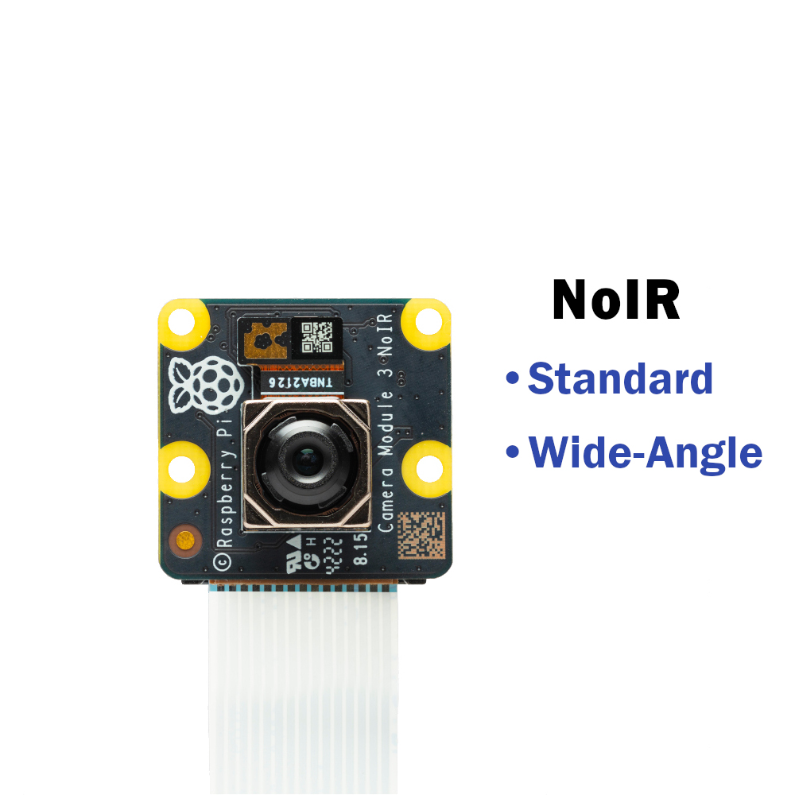
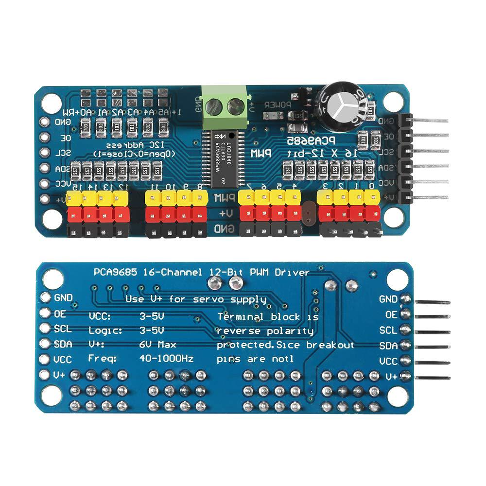
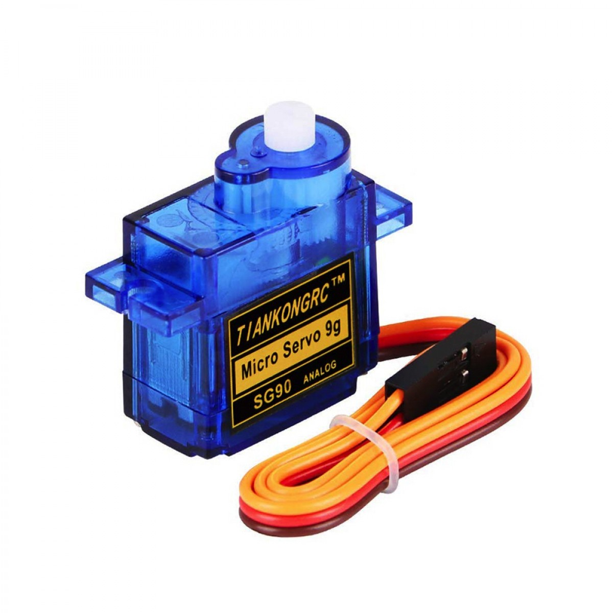
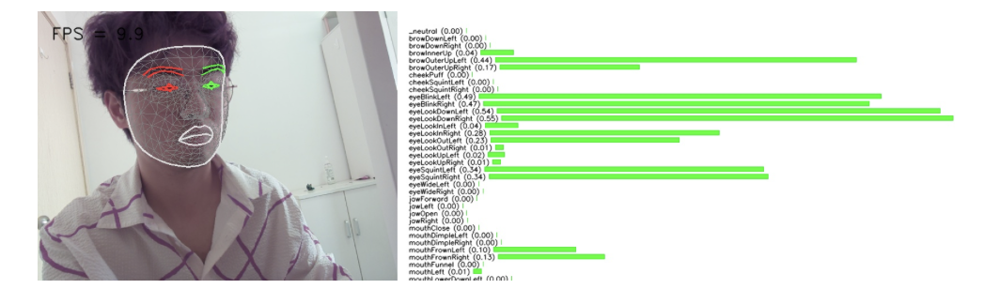

# Raspberry Pi NOIR V3 Wide Camera Module with Dual-Servo Face Tracking #

  
  
  

## Overview

This module integrates a `Raspberry Pi Camera V3 NOIR Wide` with a `dual-servo gimbal system (SG90)` (controlled via `PCA9685 PWM driver`), enabling real-time **driver face tracking** and **facial motion analysis**. It serves as a core component in the intelligent driving system, allowing detection of distracted or fatigued driver behaviors.

The camera's physical orientation is controlled by:
- **Tilt servo** — vertical tracking
- **Gimbal servo** — horizontal tracking

Together with facial analysis algorithms, the system tracks head movements and monitors driver alertness.

## Objectives

- Track the driver’s face in real time  
- Detect facial cues indicating **drowsiness, distraction, or fatigue**, such as:
  - Head nodding
  - Eye closure or blinking frequency
  - Yawning
  - Looking away from the road (left/right)

### 🧠 Software Algorithms

| Task                          | Technology Used                             |
|-------------------------------|---------------------------------------------|
| **Face Detection**            | HAAR Cascade Classifier (OpenCV)            |
| **Facial Landmark Detection** | MediaPipe `face_landmarker` Model           |
| **Behavior Detection**        | Landmark-based logic for nodding, yawning, etc. |

- The **HAAR model** provides fast and lightweight face localization
- The **Mediapipe model** enables precise detection of eye, mouth, and head movement

### ⚙️ Hardware Components

| Component                    | Description                                   |
|------------------------------|-----------------------------------------------|
| Camera Module                | Raspberry Pi Camera V3 NOIR Wide              |
| Servo Controller             | PCA9685 PWM Driver (I2C interface)            |
| Servo Motors (x2)            | SG90 tilt (vertical) and pan (horizontal)     |
| 2D servo gimbal              | Adapt to Servo                                |

> 📌 The NOIR camera has no IR filter, enhancing visibility in **low-light environments**, ideal for night driving monitoring. Its wide feature allows it to accept images up to 120 degrees, allowing for better tracking of the driver's head.

### 🛠️ Raspberry Pi Wiring (PCA9685 + Camera)

| Device         | Pin            | Raspberry Pi GPIO (BCM) | Description                |
|----------------|----------------|--------------------------|----------------------------|
| PCA9685        | SDA            | GPIO2 (SDA)              | I²C Data                   |
| PCA9685        | SCL            | GPIO3 (SCL)              | I²C Clock                  |
| PCA9685        | VCC            | Raspberry Pi 5V          | Power Supply               |
| PCA9685        | GND            | GND                      | Ground                     |
| Camera Module  | Ribbon Cable   | CSI Port                 | Connects to Pi Camera Port |

| Device         | Pin            | PCA9685                  | Description                |
|----------------|----------------|--------------------------|----------------------------|
| SG90 (Gimbal)  | PWM+VCC+GND    | PWM10                  | Servo control               |
| SG90 (Tilt)    | PWM+VCC+GND    | PWM11                  | Servo control               |

### Facial Landmark Example

### Sample Output

| Time                | Category             | Average Score |
|---------------------|----------------------|---------------|
| 2025-06-20 14:16:28 | _neutral             | 0.0           |
| 2025-06-20 14:16:28 | browDownLeft         | 0.26          |
| 2025-06-20 14:16:28 | browDownRight        | 0.24          |
| 2025-06-20 14:16:28 | browInnerUp          | 0.01          |
| 2025-06-20 14:16:28 | browOuterUpLeft      | 0.03          |
| 2025-06-20 14:16:28 | browOuterUpRight     | 0.03          |
| 2025-06-20 14:16:28 | cheekPuff            | 0.0           |
| 2025-06-20 14:16:28 | cheekSquintLeft      | 0.0           |
| 2025-06-20 14:16:28 | cheekSquintRight     | 0.0           |
| 2025-06-20 14:16:28 | eyeBlinkLeft         | 0.19          |
| 2025-06-20 14:16:28 | eyeBlinkRight        | 0.08          |
| 2025-06-20 14:16:28 | eyeLookDownLeft      | 0.66          |
| 2025-06-20 14:16:28 | eyeLookDownRight     | 0.69          |
| 2025-06-20 14:16:28 | eyeLookInLeft        | 0.04          |
| 2025-06-20 14:16:28 | eyeLookInRight       | 0.11          |
| 2025-06-20 14:16:28 | eyeLookOutLeft       | 0.24          |
| 2025-06-20 14:16:28 | eyeLookOutRight      | 0.11          |
| 2025-06-20 14:16:28 | eyeLookUpLeft        | 0.01          |
| 2025-06-20 14:16:28 | eyeLookUpRight       | 0.01          |
| 2025-06-20 14:16:28 | eyeSquintLeft        | 0.38          |
| 2025-06-20 14:16:28 | eyeSquintRight       | 0.24          |
| 2025-06-20 14:16:28 | eyeWideLeft          | 0.02          |
| 2025-06-20 14:16:28 | eyeWideRight         | 0.09          |
| 2025-06-20 14:16:28 | jawForward           | 0.0           |
| 2025-06-20 14:16:28 | jawLeft              | 0.0           |
| 2025-06-20 14:16:28 | jawOpen              | 0.13          |
| 2025-06-20 14:16:28 | jawRight             | 0.01          |
| 2025-06-20 14:16:28 | mouthClose           | 0.01          |
| 2025-06-20 14:16:28 | mouthDimpleLeft      | 0.01          |
| 2025-06-20 14:16:28 | mouthDimpleRight     | 0.0           |
| 2025-06-20 14:16:28 | mouthFrownLeft       | 0.0           |
| 2025-06-20 14:16:28 | mouthFrownRight      | 0.0           |
| 2025-06-20 14:16:28 | mouthFunnel          | 0.02          |
| 2025-06-20 14:16:28 | mouthLeft            | 0.01          |
| 2025-06-20 14:16:28 | mouthLowerDownLeft   | 0.01          |
| 2025-06-20 14:16:28 | mouthLowerDownRight  | 0.02          |
| 2025-06-20 14:16:28 | mouthPressLeft       | 0.02          |
| 2025-06-20 14:16:28 | mouthPressRight      | 0.0           |
| 2025-06-20 14:16:28 | mouthPucker          | 0.17          |
| 2025-06-20 14:16:28 | mouthRight           | 0.01          |
| 2025-06-20 14:16:28 | mouthRollLower       | 0.02          |
| 2025-06-20 14:16:28 | mouthRollUpper       | 0.02          |
| 2025-06-20 14:16:28 | mouthShrugLower      | 0.04          |
| 2025-06-20 14:16:28 | mouthShrugUpper      | 0.03          |
| 2025-06-20 14:16:28 | mouthSmileLeft       | 0.0           |
| 2025-06-20 14:16:28 | mouthSmileRight      | 0.0           |
| 2025-06-20 14:16:28 | mouthStretchLeft     | 0.0           |
| 2025-06-20 14:16:28 | mouthStretchRight    | 0.0           |
| 2025-06-20 14:16:28 | mouthUpperUpLeft     | 0.01          |
| 2025-06-20 14:16:28 | mouthUpperUpRight    | 0.0           |
| 2025-06-20 14:16:28 | noseSneerLeft        | 0.0           |
| 2025-06-20 14:16:28 | noseSneerRight       | 0.0           |
| 2025-06-20 14:16:29 | _neutral             | 0.0           |
| 2025-06-20 14:16:29 | browDownLeft         | 0.04          |
| 2025-06-20 14:16:29 | browDownRight        | 0.03          |
| 2025-06-20 14:16:29 | browInnerUp          | 0.52          |
| 2025-06-20 14:16:29 | browOuterUpLeft      | 0.52          |
| 2025-06-20 14:16:29 | browOuterUpRight     | 0.34          |
| 2025-06-20 14:16:29 | cheekPuff            | 0.0           |
| 2025-06-20 14:16:29 | cheekSquintLeft      | 0.0           |
| 2025-06-20 14:16:29 | cheekSquintRight     | 0.0           |
| 2025-06-20 14:16:29 | eyeBlinkLeft         | 0.37          |
| 2025-06-20 14:16:29 | eyeBlinkRight        | 0.35          |
| 2025-06-20 14:16:29 | eyeLookDownLeft      | 0.34          |
| 2025-06-20 14:16:29 | eyeLookDownRight     | 0.38          |
| 2025-06-20 14:16:29 | eyeLookInLeft        | 0.1           |
| 2025-06-20 14:16:29 | eyeLookInRight       | 0.07          |
| 2025-06-20 14:16:29 | eyeLookOutLeft       | 0.08          |
| 2025-06-20 14:16:29 | eyeLookOutRight      | 0.11          |
| 2025-06-20 14:16:29 | eyeLookUpLeft        | 0.04          |
| 2025-06-20 14:16:29 | eyeLookUpRight       | 0.02          |
| 2025-06-20 14:16:29 | eyeSquintLeft        | 0.55          |
| 2025-06-20 14:16:29 | eyeSquintRight       | 0.38          |
| 2025-06-20 14:16:29 | eyeWideLeft          | 0.0           |
| 2025-06-20 14:16:29 | eyeWideRight         | 0.0           |
| 2025-06-20 14:16:29 | jawForward           | 0.0           |
| 2025-06-20 14:16:29 | jawLeft              | 0.02          |
| 2025-06-20 14:16:29 | jawOpen              | 0.22          |
| 2025-06-20 14:16:29 | jawRight             | 0.0           |
| 2025-06-20 14:16:29 | mouthClose           | 0.0           |
| 2025-06-20 14:16:29 | mouthDimpleLeft      | 0.01          |
| 2025-06-20 14:16:29 | mouthDimpleRight     | 0.0           |
| 2025-06-20 14:16:29 | mouthFrownLeft       | 0.01          |
| 2025-06-20 14:16:29 | mouthFrownRight      | 0.01          |
| 2025-06-20 14:16:29 | mouthFunnel          | 0.01          |
| 2025-06-20 14:16:29 | mouthLeft            | 0.0           |
| 2025-06-20 14:16:29 | mouthLowerDownLeft   | 0.01          |
| 2025-06-20 14:16:29 | mouthLowerDownRight  | 0.01          |
| 2025-06-20 14:16:29 | mouthPressLeft       | 0.0           |
| 2025-06-20 14:16:29 | mouthPressRight      | 0.01          |
| 2025-06-20 14:16:29 | mouthPucker          | 0.06          |
| 2025-06-20 14:16:29 | mouthRight           | 0.0           |
| 2025-06-20 14:16:29 | mouthRollLower       | 0.02          |
| 2025-06-20 14:16:29 | mouthRollUpper       | 0.0           |
| 2025-06-20 14:16:29 | mouthShrugLower      | 0.02          |
| 2025-06-20 14:16:29 | mouthShrugUpper      | 0.08          |
| 2025-06-20 14:16:29 | mouthSmileLeft       | 0.0           |
| 2025-06-20 14:16:29 | mouthSmileRight      | 0.0           |
| 2025-06-20 14:16:29 | mouthStretchLeft     | 0.0           |
| 2025-06-20 14:16:29 | mouthStretchRight    | 0.01          |
| 2025-06-20 14:16:29 | mouthUpperUpLeft     | 0.0           |
| 2025-06-20 14:16:29 | mouthUpperUpRight    | 0.0           |
| 2025-06-20 14:16:29 | noseSneerLeft        | 0.0           |
| 2025-06-20 14:16:29 | noseSneerRight       | 0.0           |
