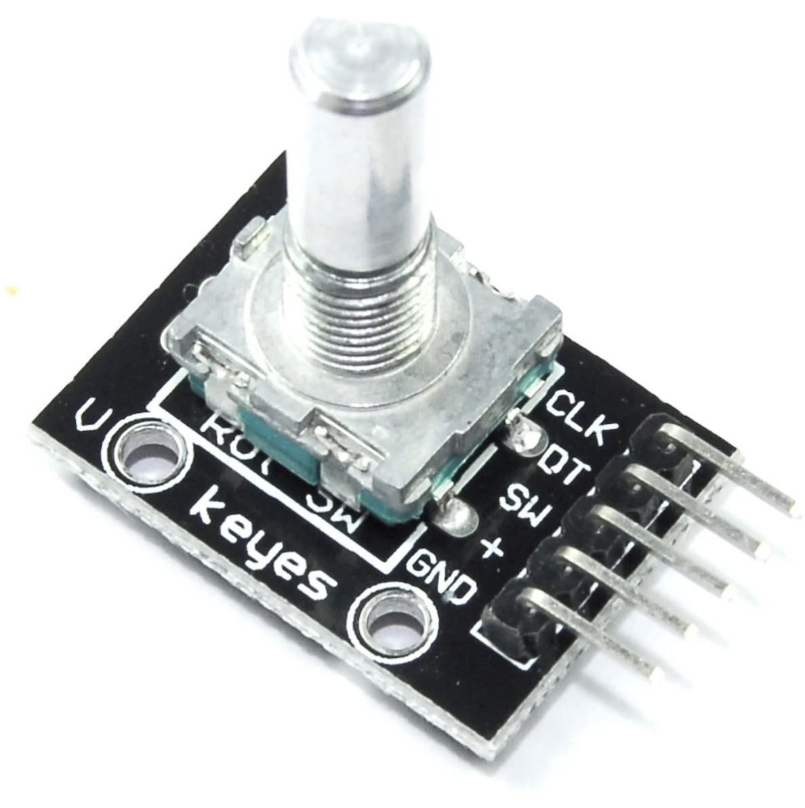
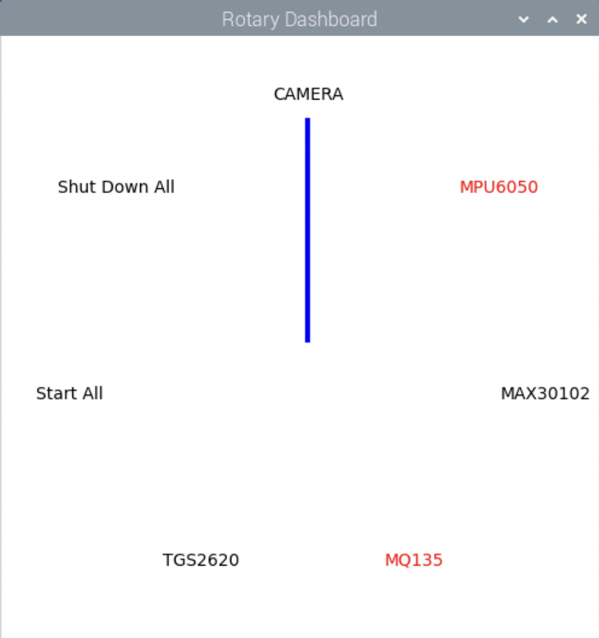

# KY-040 Rotary Encoder Control #

## Overview

The `KY-040` is a digital rotary encoder module that detects **rotational direction and steps** using two phase-shifted signals (A and B), plus an optional push-button switch (SW). It is commonly used in user input devices, volume knobs, and menu navigation systems. In this project, the KY-040 encoder is used as a **control interface to toggle the activation or shutdown of sensors and the Pi camera**, allowing seamless mode switching for driver behavior monitoring.

## Working Principle

The KY-040 encoder generates two **quadrature signals (CLK and DT)** when the knob is rotated. These are offset in phase, which allows the program to determine both:
- **Direction** (clockwise or counterclockwise)
- **Incremental position**

Additionally, pressing or holding the built-in switch (SW) triggers two GPIO events, often used to confirm actions or exiting the program.

## Technical Specifications

| Parameter        | Value                              |
|------------------|------------------------------------|
| Interface        | Digital GPIO (CLK, DT, SW)         |
| Power Supply     | 3.3V                               |
| Signal Type      | Quadrature digital pulses          |
| Rotational Steps |           20 steps per revolution  |
| Switch Type      |      High, active-low when pressed |

## Circuit Diagram

| KY-040 Pin | Description     | Raspberry Pi GPIO (BCM) | Example Usage     |
|------------|------------------|--------------------------|-------------------|
| GND        | Ground            | GND                      | Common ground     |
| +          | VCC (3.3V/5V)     | 3.3V                       | Power supply      |
| CLK        | Signal A          |  GPIO6             | Rotation detection |
| DT         | Signal B          |  GPIO5             | Rotation detection |
| SW         | Push-button       |  GPIO12             | Start/stop toggle |

## User Interface Design
The program start as soon as the raspberri pi powered. And the UI below will show on the screen:

Rotate the KY040 button to go through seven modes: 5 sensor + 1 start all + 1 stop all. 

Tap the button to confirm the option.

For the color of the 5 sensor: red indicates it's working; black otherwise.

Hold the button for at least 3 seconds to exit the program.

The data will be automously saved in the data folder, either when you stop a sensor or exit the program. 

However only one csv file can be saved per sensor, so be careful when you shut down your sensor, if you choose to start it again in the same process(Starting the same sensor twice before exiting the program), the earlier data will be lost.

## Datasheet
https://www.handsontec.com/dataspecs/module/Rotary%20Encoder.pdf
