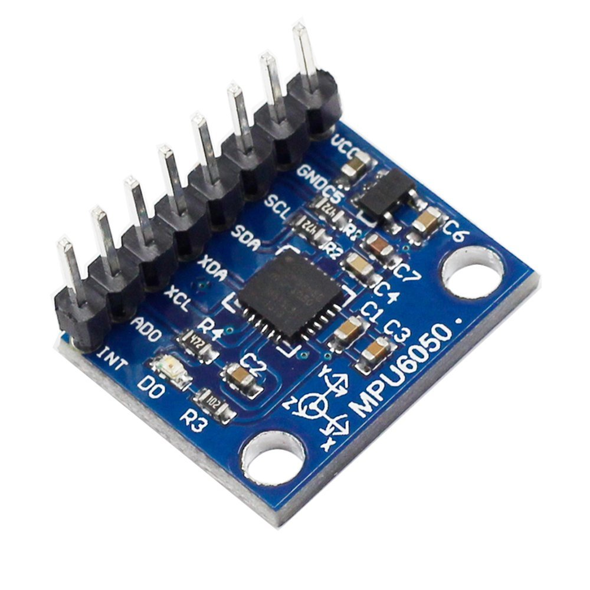

# MPU6050 Module #

## Overview:

The `MPU6050` is a popular MEMS (Micro-Electro-Mechanical Systems) module that combines a **3-axis gyroscope** and **3-axis accelerometer** on a single chip. It is widely used in motion detection, gesture recognition, robotics, and driver behavior monitoring applications. This module communicates via the **I²C interface**, making it easy to integrate with Raspberry Pi.

## Working Principle:

The MPU6050 continuously tracks **angular velocity (gyro)** and **linear acceleration (accel)** along the X, Y, and Z axes. These raw data values can be used to:
- Detect sharp turns
- Detect emergent braking
- Detect emergent acceleration

## Hardware Equipment:

- Raspberry Pi 5 board
- Power adapter
- 40-pin ribbon cable
- MPU6050 Sensor
- Jumpers

## Circuit Diagram:

| MAX30102 Pin | Description   | Raspberry Pi GPIO (BCM) | 
|--------------|----------------|------------------------|
| VIN          | Power Input     | 3.3V                  | 
| GND          | Ground          | GND                   | 
| SDA          | I²C Data Line   | GPIO2 (SDA)           | 
| SCL          | I²C Clock Line  | GPIO3 (SCL)           | 

## Technical Specification:

| Parameter        | Value                              |
|------------------|------------------------------------|
| Interface        | I²C                                |
| Supply Voltage   | 3.3V                               |
| Output Data      | 3-axis Accelerometer + 3-axis Gyroscope + Temperature |
| I2C Address      | `0x68` (default), `0x69` (ALT low) |

## Sample Output

| Time                | Accelerometer_x | Accelerometer_y | Accelerometer_z | Gyroscope_x | Gyroscope_y  | Gyroscope_z  | Temperature |
| ------------------- | --------------- | --------------- | --------------- | ----------- | ------------ | ------------ | ----------- |
| 2024-07-04 13:07:19 | 0.1436521       | 0.021547815     | 9.969455713     | 2.580152672 | -1.091603053 | -0.984732824 | 32.05941176 |
| 2024-07-04 13:07:20 | 0.165199915     | 0.021547815     | 10.01255134     | 2.427480916 | -1.190839695 | -1.099236641 | 32.71823529 |
| 2024-07-04 13:07:20 | 0.217872351     | -0.009576807    | 10.10831941     | 2.282442748 | -1.167938931 | -1.183206107 | 32.10647059 |
| 2024-07-04 13:07:21 | 0.184353528     | 0.031124622     | 9.959878906     | 2.358778626 | -1.198473282 | -1.114503817 | 32.10647059 |
| 2024-07-04 13:07:21 | 0.167594116     | 0.136469495     | 10.10831941     | 2.160305344 | -0.847328244 | -1.13740458  | 32.05941176 |
| 2024-07-04 13:07:22 | 0.265756384     | 0.002394202     | 9.998186133     | 2.419847328 | -1.106870229 | -0.992366412 | 32.15352941 |
| 2024-07-04 13:07:22 | 0.201112939     | -0.148440503    | 9.844957227     | 2.503816794 | -1.259541985 | -1.152671756 | 32.20058824 |
| 2024-07-04 13:07:23 | 0.17238252      | 0.124498486     | 9.940725293     | 2.580152672 | -1.030534351 | -1.114503817 | 32.05941176 |
| 2024-07-04 13:07:23 | 0.169988318     | -0.110133276    | 9.876081848     | 2.374045802 | -1.13740458  | -1.198473282 | 32.20058824 |
| 2024-07-04 13:07:24 | 0.177170923     | 0.035913025     | 9.923965881     | 2.557251908 | -1.175572519 | -1.129770992 | 32.10647059 |
| 2024-07-04 13:07:24 | 0.146046301     | 0.04309563      | 10.04367596     | 2.404580153 | -1.038167939 | -1.167938931 | 32.10647059 |

## Datasheet
https://www.alldatasheet.com/datasheet-pdf/download/517744/ETC1/MPU-6050.html
