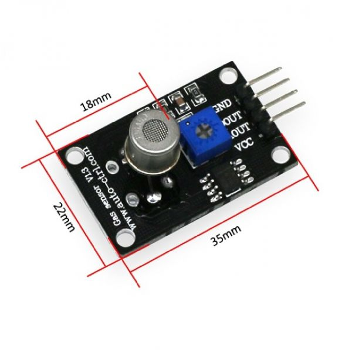

# TGS2620 Module #

## Overview

The `TGS2620` is a semiconductor gas sensor designed for detecting a wide range of **organic solvent vapors and volatile gases**, including those found in **cigarette smoke, alcohol, and adhesives**. It is suitable for applications involving **air quality monitoring**, **smoke detection**, and **driver smoking behavior analysis**. This sensor provides an **analog output** that reflects gas concentration levels and requires an **external ADC** (like MCP3008) when interfaced with a Raspberry Pi.

## Working Principle

TGS2620 uses a **heated tin dioxide (SnO₂) sensing layer**, whose resistance varies in the presence of target gases. As gas concentration increases, the sensor's resistance drops, causing the output voltage to rise (across the load resistor).

It is particularly sensitive to:
- **Alcohol vapors**
- **Cigarette smoke**

## Hardware Equipment:

- Raspberry Pi 5 board
- Power adapter
- 40-pin ribbon cable
- MQ2 Sensor
- MCP3008 Digital-Analog converter
- Jumpers

## Circuit Diagram:

| TGS2620 Pin | Description        | Connection                   |
|-------------|--------------------|-------------------------------|
| VCC         | Power Input (5V)   | Raspberry Pi 5V   |
| GND         | Ground             | Raspberry Pi GND  |
| AOUT        | Analog Output      | MCP3008 CH1       |

## Technical Specifications

| Parameter         | Value                                      |
|-------------------|--------------------------------------------|
| Interface         | Analog output (AOUT)                       |
| Supply Voltage    | 5V (±0.2V)                                 |
| Heater Voltage    | 5V (±0.2V)                                 |
| Heater Resistance | 83 Ω ±10% (room temp)                      |
| Preheat Time      | ≥ 1 min for heating                        |
| Detection Gases   | Alcohol, smoke, organic solvents           |
| Output Type       | Voltage proportional to gas concentration  |

## Sample Output:
| Time                |   Initial Alcohol Value |   Processed Alcohol Value | State   |   Warning time period(s) |
|:--------------------|------------------------:|--------------------------:|:--------|-------------------------:|
| 2025-06-06 21:41:56 |                0.370787 |                       371 | Safe    |                        0 |
| 2025-06-06 21:41:57 |                0.369809 |                       370 | Safe    |                        0 |
| 2025-06-06 21:41:58 |                0.370787 |                       371 | Safe    |                        0 |
| 2025-06-06 21:41:59 |                0.369809 |                       370 | Safe    |                        0 |
| 2025-06-06 21:42:00 |                0.367855 |                       368 | Safe    |                        0 |
| 2025-06-06 21:42:01 |                0.366878 |                       367 | Safe    |                        0 |
| 2025-06-06 21:42:02 |                0.365901 |                       366 | Safe    |                        0 |
| 2025-06-06 21:42:03 |                0.364924 |                       365 | Safe    |                        0 |
| 2025-06-06 21:42:04 |                0.364924 |                       365 | Safe    |                        0 |
| 2025-06-06 21:42:05 |                0.36297  |                       363 | Safe    |                        0 |
| 2025-06-06 21:42:06 |                0.36297  |                       363 | Safe    |                        0 |
| 2025-06-06 21:42:07 |                0.365901 |                       366 | Safe    |                        0 |
| 2025-06-06 21:42:08 |                0.364924 |                       365 | Safe    |                        0 |
| 2025-06-06 21:42:09 |                0.363947 |                       364 | Safe    |                        0 |
| 2025-06-06 21:42:10 |                0.361993 |                       362 | Safe    |                        0 |
| 2025-06-06 21:42:11 |                0.36297  |                       363 | Safe    |                        0 |
| 2025-06-06 21:42:12 |                0.361993 |                       362 | Safe    |                        0 |
| 2025-06-06 21:42:13 |                0.361993 |                       362 | Safe    |                        0 |
| 2025-06-06 21:42:14 |                0.361016 |                       361 | Safe    |                        0 |
| 2025-06-06 21:42:15 |                0.361016 |                       361 | Safe    |                        0 |
| 2025-06-06 21:42:16 |                0.361016 |                       361 | Safe    |                        0 |
| 2025-06-06 21:42:17 |                0.361993 |                       362 | Safe    |                        0 |
| 2025-06-06 21:42:18 |                0.360039 |                       360 | Safe    |                        0 |
| 2025-06-06 21:42:19 |                0.359062 |                       359 | Safe    |                        0 |
| 2025-06-06 21:42:20 |                0.356131 |                       356 | Safe    |                        0 |
| 2025-06-06 21:42:21 |                0.354177 |                       354 | Safe    |                        0 |
| 2025-06-06 21:42:22 |                0.354177 |                       354 | Safe    |                        0 |
| 2025-06-06 21:42:23 |                0.354177 |                       354 | Safe    |                        0 |
| 2025-06-06 21:42:24 |                0.355154 |                       355 | Safe    |                        0 |
| 2025-06-06 21:42:25 |                0.352223 |                       352 | Safe    |                        0 |
| 2025-06-06 21:42:26 |                0.352223 |                       352 | Safe    |                        0 |
| 2025-06-06 21:42:27 |                0.352223 |                       352 | Safe    |                        0 |
| 2025-06-06 21:42:28 |                0.356131 |                       356 | Safe    |                        0 |
| 2025-06-06 21:42:29 |                0.355154 |                       355 | Safe    |                        0 |
| 2025-06-06 21:42:30 |                0.3532   |                       353 | Safe    |                        0 |
| 2025-06-06 21:42:31 |                0.352223 |                       352 | Safe    |                        0 |
| 2025-06-06 21:42:32 |                0.3532   |                       353 | Safe    |                        0 |
| 2025-06-06 21:42:33 |                0.350269 |                       350 | Safe    |                        0 |
| 2025-06-06 21:42:34 |                0.349292 |                       349 | Safe    |                        0 |

## Datasheet
https://www.alldatasheet.com/datasheet-pdf/download/1148643/FIGARO/TGS2620.html

